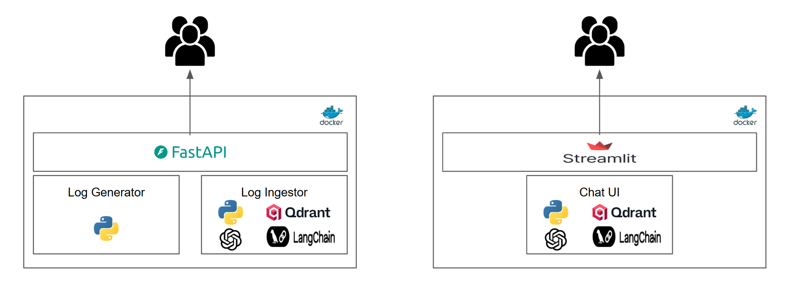
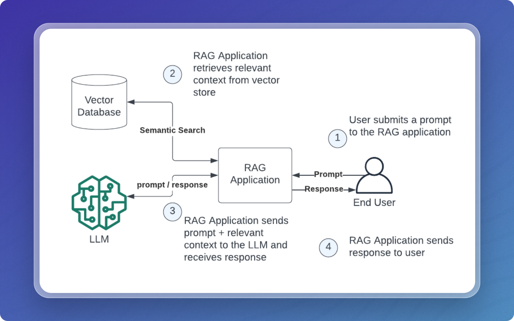

# Observability AI Agent

An intelligent observability platform powered by a **LangChain ReAct Agent + RAG Retrieval Pipeline**, enabling AI-driven analysis of system logs, incidents, and operational data. The agent uses natural language reasoning, tool execution, and vector-based retrieval to answer operational queries and assist in incident diagnosis.

## Overview

This project implements a **ReAct (Reasoning + Action) AI Agent** enhanced with **RAG-style retrieval**, combining:

- 🔹 **LangChain Agent** for reasoning + tool orchestration
- 🔹 **Qdrant vector search** for semantic log and ticket retrieval
- 🔹 **OpenAI LLM** for analysis, summarization, and contextual responses

The agent chooses tools such as log search, ticket search, and summarization using the ReAct framework, while the retrieval layer ensures contextual accuracy.



### Why ReAct + RAG?

This project is not just RAG — it is an **AI Agent that uses tools, with RAG as one of those tools**.

#### Benefits

- **Tool-Using Intelligence**  
  The agent selects tools like `SearchLogs`, `SearchTickets`, and `SummarizeLogs` through natural language reasoning.

- **Contextual Retrieval (RAG)**  
  The system retrieves relevant logs and incident tickets using vector embeddings.

- **Structured Reasoning (ReAct)**  
  The LLM thinks step-by-step, chooses tools, evaluates results, then forms a final answer.

- **Operational Awareness**  
  Query logs, analyze incidents, and detect anomalies using natural language.



## Key Features

- **ReAct-Agent Architecture**: LLM chooses tools and reasons step-by-step
- **RAG-Enhanced Retrieval**: Semantic search on logs and tickets via Qdrant
- **AI Log Analysis**: Natural language analysis of logs with threshold-based retrieval
- **Incident Ticket Reasoning**: Fetch and summarize related incident tickets
- **Callback Tracing**: Full visibility into tool selection and agent decisions
- **RESTful API**: FastAPI for accessing agent features programmatically
- **Interactive UI**: Streamlit interface for user-friendly querying
- **Dockerized Deployment**: Full deployment stack with Docker Compose

---

# ReAct Agent + RAG Architecture

This project blends **two powerful patterns**:

---

## 1. ReAct Agent (Reasoning + Actions)

A LangChain agent that:

- Interprets user queries
- Decides which tool to call
- Performs retrieval via Qdrant
- Summarizes findings
- Returns a final answer

The agent uses the following tools:

- `SearchLogs`
- `SearchTickets`
- `SummarizeLogs`

---

## 2. RAG Retrieval Layer

Used as a tool _inside_ the agent.

Core components:

- **Embeddings**: `text-embedding-3-small`
- **Vector Store**: Qdrant
- **Threshold Retriever**: A custom retriever with similarity filtering
- **Metadata Enrichment**: Includes scores and ticket IDs

---

# Architecture Workflow

1. **User Query** → Natural language question
2. **Agent Reasoning (ReAct)** → LLM decides which tool to use
3. **Semantic Retrieval (RAG)** → Fetches logs/tickets from vector store
4. **Threshold Filtering** → Removes low-relevance results
5. **LLM Generation** → Final answer enriched with retrieved context

---

# Project Structure

```
observability-ai-agent/
├── docker-compose.yml             # Docker services configuration
├── Dockerfile                     # Container build instructions
├── requirements.txt               # Python dependencies
├── images/                        # Documentation images
├── ingest-tracker/                # Ingestion tracking
│   ├── ingested_files.json        # Tracker for ingested log files
│   └── ingested_tickets.json      # Tracker for ingested tickets
├── logs/                          # Application logs
├── src/                           # Source code
│   ├── api.py                     # FastAPI application
│   ├── app.py                     # Streamlit web interface
│   ├── log_generator.py           # Log generation utilities
│   ├── log_ingestor.py            # Log ingestion into Vector DB
│   ├── observability_engine.py    # Core AI engine
│   ├── ticket_generator.py        # Ticket generation
│   └── ticket_ingestor.py         # Ticket ingestion into Vector DB
├── static-logs/                   # Sample log files
└── tickets/                       # Generated tickets
```

## Prerequisites

- Python 3.11+
- Docker and Docker Compose
- OpenAI API key
- Qdrant vector database (cloud or self-hosted)

## Installation

### 1. Clone the Repository

```bash
git clone <repository-url>
cd observability-ai-agent
```

### 2. Environment Setup

Copy the `.env` file and configure your API keys:

```bash
# Required API Keys
OPENAI_API_KEY=your_openai_api_key
QDRANT_URL=your_qdrant_url
QDRANT_CLOUD_API_KEY=your_qdrant_api_key

# Optional: LangChain Tracing
LANGCHAIN_API_KEY=your_langchain_api_key
LANGCHAIN_TRACING_V2=true

# Configuration
EMBEDDING_MODEL=text-embedding-3-small
RETRIEVAL_MODEL=gpt-4-mini
COLLECTION_NAME=aks_logs
DEFAULT_K=5
THRESHOLD_LIMIT=0.2
```

### 3. Docker Deployment (Recommended)

```bash
# Build and start services
docker-compose up --build

# Access the applications
# API: http://localhost:8000/docs
# Streamlit UI: http://localhost:8501
```

### 4. Local Development

```bash
# Install dependencies
pip install -r requirements.txt

# Start the API server
cd src
uvicorn api:app --host 0.0.0.0 --port 8000

# Start the Streamlit app (in another terminal)
cd src
streamlit run app.py --server.port=8501
```

### 5. Running through CLI

```bash
# Install dependencies
pip install -r requirements.txt

# Generate sample logs
cd src
python log_generator.py <Date YYYY-MM-DD> <Number of logs>

# Generate sample tickets
cd src
python ticket_generator.py <Date YYYY-MM-DD> <Number of tickets>

# Ingest logs and tickets
cd src
python log_ingestor.py
python ticket_ingestor.py

# Query through CLI
cd src
python observability_engine.py
```

## Usage

### Web Interface (RAG Queries)

1. Navigate to `http://localhost:8501`
2. Use natural language to query your logs and tickets - the RAG system will retrieve relevant context and generate accurate responses
3. Examples:
   - "Show me all error logs from yesterday" - _RAG retrieves matching error logs and provides detailed analysis_
   - "What tickets occurred in the last 24 hours?" - _RAG finds recent tickets and summarizes incidents_
   - "Find logs related to authentication failures" - _RAG performs semantic search for auth-related issues_
   - "Analyze the root cause of database connection errors" - _RAG retrieves relevant logs and provides diagnostic insights_

### API Endpoints

The FastAPI server provides several endpoints:

- `POST /generate-logs` - Generate sample logs for testing
- `POST /ingest-logs` - Ingest log files into the vector database
- `POST /generate-tickets` - Generate simulating incident tickets
- `POST /ingest-tickets` - Ingest ticket files into the vector database

### API Documentation

Visit `http://localhost:8000/docs` for interactive API documentation.

## Configuration

Key configuration options in `.env`:

| Variable          | Description                   | Default                |
| ----------------- | ----------------------------- | ---------------------- |
| `OPENAI_API_KEY`  | OpenAI API key for LLM access | Required               |
| `QDRANT_URL`      | Qdrant database URL           | Required               |
| `EMBEDDING_MODEL` | OpenAI embedding model        | text-embedding-3-small |
| `RETRIEVAL_MODEL` | LLM model for queries         | gpt-5-mini             |
| `COLLECTION_NAME` | Qdrant collection for logs    | aks_logs               |
| `DEFAULT_K`       | Number of results to retrieve | 5                      |
| `THRESHOLD_LIMIT` | Similarity threshold          | 0.2                    |

## Development

### Extending the AI Engine

The observability engine uses LangChain agents. To add new capabilities:

1. Define new tools in `observability_engine.py`
2. Update the agent initialization
3. Test with the Streamlit interface

## Dependencies

Key Python packages for RAG implementation:

- **LangChain**: RAG agent framework and Agent orchestration
- **OpenAI**: LLM for generation and embedding models for retrieval
- **Qdrant**: Vector database for storing and searching embeddings
- **FastAPI**: Web API framework for RAG endpoints
- **Streamlit**: Interactive web interface for RAG queries
- **Pydantic**: Data validation and modeling
- **Tiktoken**: Token counting for optimal chunking strategies

## License

This project is licensed under the terms specified in the LICENSE file.
